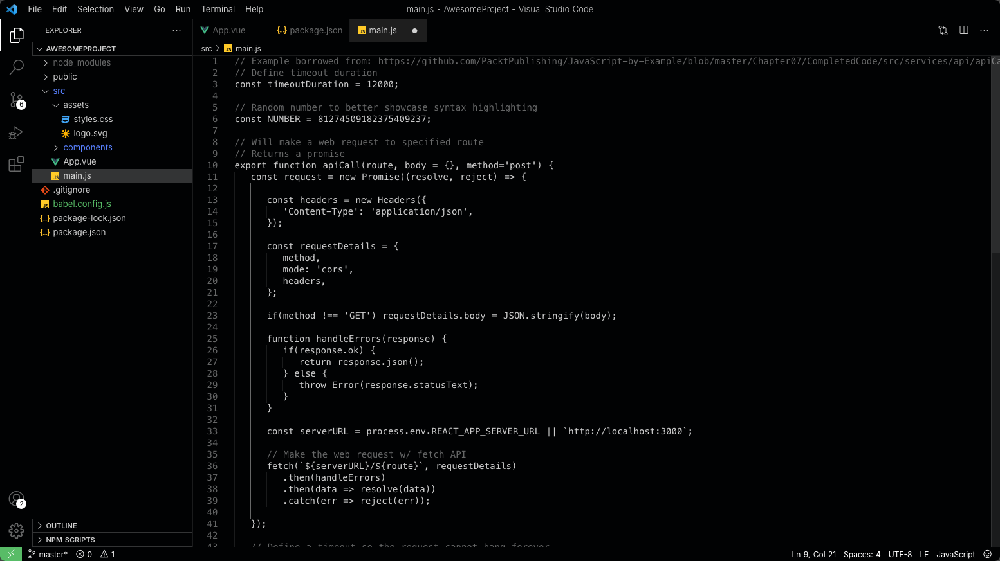

# Rich black, no highlighting - VS Code theme

A VSCode theme that removes all syntax highlighting apart from dimming comments.

Created with [Theme Studio for VS Code](https://themes.vscode.one/theme/KrisBastiani/QEneSUDZ).

Available on the [Visual Studio Marketplace](https://marketplace.visualstudio.com/items?itemName=KrisBastiani.vscode-theme-rich-black-no-highlighting).

